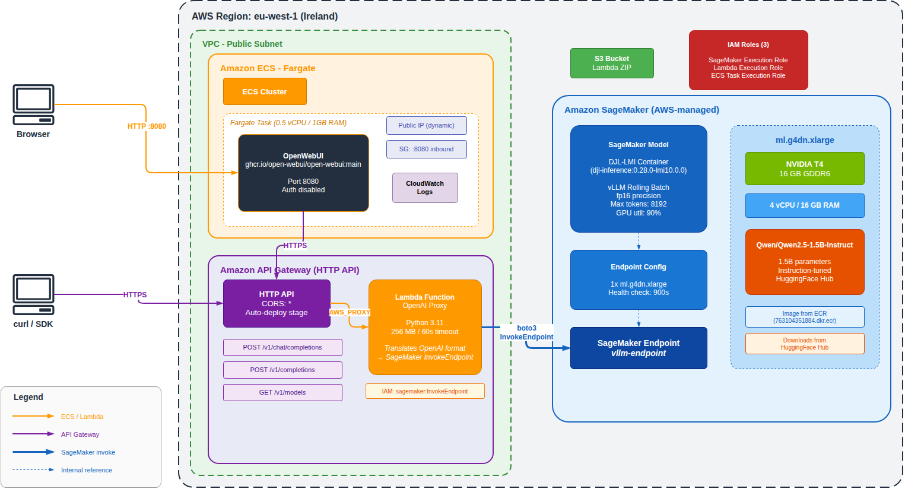
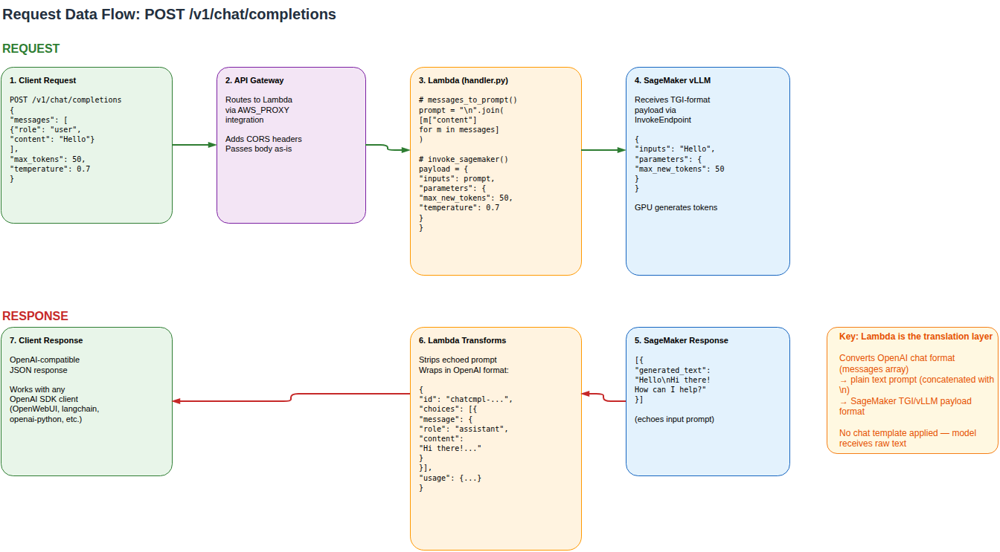
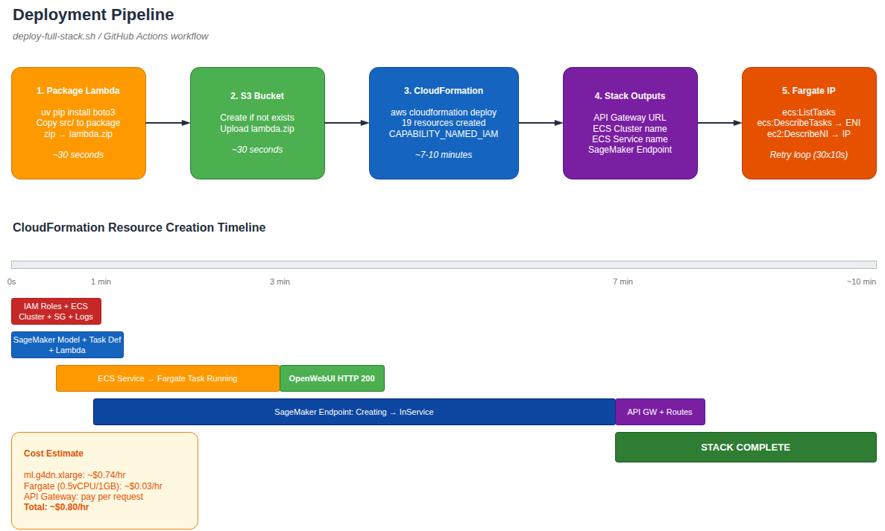

# Architecture

This document describes the complete architecture of the **sagemaker-using_model** deployment stack.

## Overview

The stack provides an **OpenAI-compatible API** backed by a GPU-accelerated language model on AWS SageMaker, with a web-based chat interface (OpenWebUI) running on ECS Fargate.



### Components

| Component | AWS Service | Purpose |
|-----------|------------|---------|
| **OpenWebUI** | ECS Fargate | Web-based chat UI (port 8080) |
| **API Gateway** | HTTP API | Public HTTPS endpoint with CORS |
| **Lambda Proxy** | Lambda (Python 3.11) | Translates OpenAI format to SageMaker |
| **vLLM Endpoint** | SageMaker | GPU inference with DJL-LMI container |

### Key Design Decisions

- **No ALB** — Fargate tasks get a public IP directly (saves ~$16/mo, single subnet is sufficient)
- **No ECR** — OpenWebUI image pulled from `ghcr.io` (public registry)
- **Ephemeral storage** — Chat history is lost on Fargate task restart (acceptable for dev/testing)
- **Single CloudFormation stack** — All 19 resources managed as one unit

---

## Network Architecture

All resources deploy to **eu-west-1** (Ireland) in a single public subnet.

| Resource | Network | Access |
|----------|---------|--------|
| ECS Fargate (OpenWebUI) | VPC public subnet | Public IP, SG allows :8080 inbound |
| API Gateway | AWS-managed | Public HTTPS endpoint |
| Lambda | AWS-managed | Invoked by API Gateway |
| SageMaker Endpoint | AWS-managed | Invoked by Lambda via boto3 |

**Security Groups:**
- `openwebui-sg`: Inbound TCP 8080 from `0.0.0.0/0`, all outbound

**IAM Roles (3):**

| Role | Trusted Service | Key Permissions |
|------|----------------|-----------------|
| SageMaker Execution Role | `sagemaker.amazonaws.com` | SageMakerFullAccess, ECR pull |
| Lambda Execution Role | `lambda.amazonaws.com` | CloudWatch Logs, `sagemaker:InvokeEndpoint` |
| ECS Task Execution Role | `ecs-tasks.amazonaws.com` | ECR pull, CloudWatch Logs |

---

## Request Data Flow

The diagram below shows how a chat request is transformed at each layer:



### Step-by-step

1. **Client** sends an OpenAI-compatible request to the API Gateway (or through OpenWebUI):
   ```json
   POST /v1/chat/completions
   {"messages": [{"role": "user", "content": "Hello"}], "max_tokens": 50}
   ```

2. **API Gateway** routes the request to Lambda via `AWS_PROXY` integration. The body is passed through unchanged.

3. **Lambda** (`handler.py`) transforms the request:
   - `messages_to_prompt()` — concatenates message contents with `\n` (no chat template)
   - `invoke_sagemaker()` — wraps as TGI/vLLM payload:
     ```json
     {"inputs": "Hello", "parameters": {"max_new_tokens": 50, "temperature": 0.7}}
     ```
   - Calls `sagemaker:InvokeEndpoint` via boto3

4. **SageMaker Endpoint** runs the model on GPU and returns generated text (including echoed prompt).

5. **Lambda** strips the echoed prompt and wraps the response in OpenAI format:
   ```json
   {
     "id": "chatcmpl-...",
     "choices": [{"message": {"role": "assistant", "content": "Hi there!"}}],
     "usage": {"prompt_tokens": 1, "completion_tokens": 10, "total_tokens": 11}
   }
   ```

6. **Client** receives a standard OpenAI-compatible response, usable with any OpenAI SDK.

### API Routes

| Route | Method | Handler |
|-------|--------|---------|
| `/v1/chat/completions` | POST | `handle_chat_completion()` |
| `/v1/completions` | POST | `handle_chat_completion()` |
| `/v1/models` | GET | `handle_models_request()` |

---

## ECS Fargate (OpenWebUI)

| Setting | Value |
|---------|-------|
| Image | `ghcr.io/open-webui/open-webui:main` |
| CPU / Memory | 0.5 vCPU / 1 GB |
| Container port | 8080 |
| Network mode | awsvpc (public IP) |
| Desired count | 1 |
| Log driver | awslogs → CloudWatch |

**Environment variables injected by CloudFormation:**

| Variable | Value |
|----------|-------|
| `OPENAI_API_BASE_URL` | `${HttpApi.ApiEndpoint}/v1` |
| `OPENAI_API_KEY` | `not-required` |
| `WEBUI_AUTH` | `false` |
| `ENABLE_OLLAMA_API` | `false` |

**Note:** The Fargate task's public IP is dynamic — it changes on task restart. Use the `OpenWebUIInfo` CloudFormation output to discover the current IP.

---

## SageMaker Endpoint

| Setting | Value |
|---------|-------|
| Container | `djl-inference:0.28.0-lmi10.0.0-cu124` (DJL-LMI) |
| Instance | ml.g4dn.xlarge (NVIDIA T4, 16 GB GDDR6) |
| Model | Qwen/Qwen2.5-1.5B-Instruct |
| Batch mode | vLLM rolling batch |
| Precision | fp16 |
| Max tokens | 8192 |
| GPU utilization | 90% |
| Health check timeout | 900s |

---

## Deployment Pipeline



### Steps

| Step | Action | Duration |
|------|--------|----------|
| 1 | Package Lambda (uv pip install + zip) | ~30s |
| 2 | Create S3 bucket, upload ZIP | ~30s |
| 3 | `aws cloudformation deploy` (19 resources) | ~7-10 min |
| 4 | Retrieve stack outputs | ~5s |
| 5 | Discover Fargate task public IP (retry loop) | ~30s |

### Resource Creation Timeline

| Time | Resources Created |
|------|-------------------|
| 0-18s | IAM roles, ECS cluster, security group, log group, HTTP API |
| 18-22s | SageMaker model, ECS task definition |
| ~3 min | ECS service + Fargate task running, OpenWebUI serving |
| ~7 min | SageMaker endpoint InService |
| ~7 min | Lambda function, API Gateway routes |
| ~7 min | **Stack CREATE_COMPLETE** |

---

## Cost

| Resource | Type | Cost/Hour | Cost/Day |
|----------|------|-----------|----------|
| SageMaker | ml.g4dn.xlarge | ~$0.74 | ~$17.76 |
| ECS Fargate | 0.5 vCPU + 1GB | ~$0.03 | ~$0.72 |
| API Gateway | HTTP API | per request | ~$0.001 |
| CloudWatch | Logs | per GB ingested | negligible |
| **Total** | | **~$0.80/hr** | **~$19/day** |

**Always delete the stack when not in use.**

---

## CloudFormation Resources (19)

| # | Logical ID | Type | Notes |
|---|-----------|------|-------|
| 1 | SageMakerExecutionRole | IAM::Role | SageMaker + ECR access |
| 2 | SageMakerModel | SageMaker::Model | DJL-LMI container + env vars |
| 3 | SageMakerEndpointConfig | SageMaker::EndpointConfig | 1x ml.g4dn.xlarge |
| 4 | SageMakerEndpoint | SageMaker::Endpoint | ~7 min to create |
| 5 | LambdaExecutionRole | IAM::Role | Logs + InvokeEndpoint |
| 6 | LambdaFunction | Lambda::Function | Python 3.11, from S3 |
| 7 | HttpApi | ApiGatewayV2::Api | HTTP API with CORS |
| 8 | HttpApiStage | ApiGatewayV2::Stage | $default, auto-deploy |
| 9 | LambdaIntegration | ApiGatewayV2::Integration | AWS_PROXY |
| 10 | ChatCompletionsRoute | ApiGatewayV2::Route | POST /v1/chat/completions |
| 11 | CompletionsRoute | ApiGatewayV2::Route | POST /v1/completions |
| 12 | ModelsRoute | ApiGatewayV2::Route | GET /v1/models |
| 13 | LambdaApiGatewayPermission | Lambda::Permission | API GW invoke |
| 14 | ECSCluster | ECS::Cluster | Named cluster |
| 15 | ECSTaskExecutionRole | IAM::Role | ECR pull + logs |
| 16 | OpenWebUILogGroup | Logs::LogGroup | 7-day retention |
| 17 | ECSTaskDefinition | ECS::TaskDefinition | Fargate, 0.5 vCPU/1GB |
| 18 | OpenWebUISecurityGroup | EC2::SecurityGroup | :8080 inbound |
| 19 | ECSService | ECS::Service | Fargate, 1 task, public IP |
